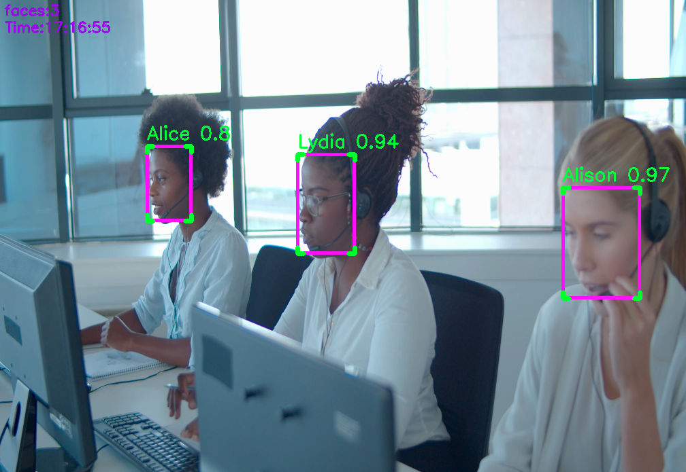

# 🧑‍💻 Employee Recognition System using YOLOv8

This project is designed to recognize employees through their desktop webcam using YOLOv8 and record the time they start and end their work each day. The system captures faces, identifies them, and logs the check-in and check-out times automatically.



## 🚀 Features

- Face detection and recognition using YOLOv8
- Automatic check-in/check-out system
- Timestamp logging with date
- Local storage of attendance logs (CSV)
- Lightweight application suitable for running on employee desktops

## 🛠️ Technologies Used

- Python 3.8+
- [YOLOv8](https://github.com/ultralytics/ultralytics)
- OpenCV
- datetime
- CSV for data storage


## 📁 Data Training Structure
```
Data/
    face/
        employee_1/
            employee_1_face-1.png
            employee_1_face-2.png
            .
            .
            employee_1_face-n.png
        employee_2/
            employee_2_face-1.png
            employee_2_face-2.png
            .
            .
            employee_2_face-n.png
        .
        .
        employee_n/
            employee_n_face-1.png
            employee_n_face-2.png
            .
            .
            employee_n_face-n.png
```

## 🧑‍💼 How It Works

1. On application startup, use saved video or the webcam is activated.
2. YOLOv8 detects faces and compares them with known employee images.
3. If a match is found:
   - If the employee has not checked in today, a check-in time is logged.
   - If the employee is leaving (after timeout or closing app), a check-out time is logged.
4. All logs are stored in a CSV file for later review.

## 🔧 Installation

```bash
# Clone the repository
git clone https://github.com/AmenAllahHemdani/Employees-Recognition-System.git
cd Employees-Recognition-System

# Create virtual environment
python -m venv venv
source venv/bin/activate  # On Windows use venv\Scripts\activate

# Install dependencies
pip install -r requirements.txt

```
Download the [model](https://huggingface.co/Ultralytics/YOLOv8), create a models folder, and place the YOLO model inside it.

## ▶️ Running

```bash
# Make data training in yolo format
python3 transform_data.py

# Trainning model
python3 training.py

# set your video in person_detection.py
if __name__ == "__main__":
    path = "video.mp4"
    main(path)

# Run
python3 person_detection.py

```

## ▶️ Result data
the result will be saved in Attendance.csv

with format :
```csv
,date,name,start_time,end_time
0,25-04-11,Alice,08:01:07,11:12:45
1,25-04-11,John,08:09:10,Null
```


